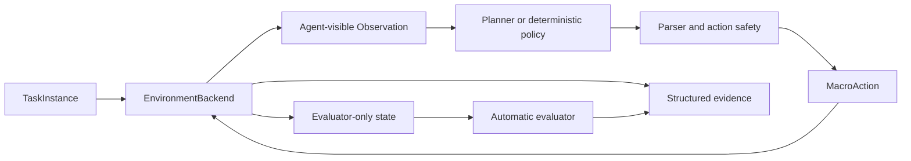

# ObsidianLink

ObsidianLink 是一个可复现的 Minecraft 单智能体基准。目标是让 Agent 使用原版水、熔岩、方块放置、点火和传送门机制构建下界传送门，并用自动评估和运行证据判断任务是否真正完成。

## 当前任务

当前阶段：`R4-DETERMINISTIC-CASTING-DRIVER`（已完成）

当前任务实例：`casting_c1_fixed`

本阶段已经在 FakeBackend 上实现确定性、有限循环的单块浇筑 driver，并由 R3 evaluator 独立判断结果：

- driver 只使用 Agent-visible observation，不读取 evaluator-only 真值；
- 动作使用公共 `MacroAction` 协议和封闭 R4 白名单；
- step、时间、等待和计划长度都有硬上限；
- 后端提前终止、预算耗尽或证据缺失都不会伪装成成功。

下一任务是 R5 连续浇筑。开始前先阅读 [PROJECT_STATUS.md](PROJECT_STATUS.md)；当前仍不启动 Minecraft、不运行 Gradle、不接 VLM。

## 项目目标

项目最终要回答三个问题：

1. Agent 是否能在受控 Minecraft 环境中完成传送门建造任务？
2. 任务结果是否能被自动 evaluator 独立验证？
3. 每次成功或失败是否有足够证据可以复现和审查？

项目采用逐步扩展方式：先验证一块黑曜石，再验证连续浇筑、完整门框、点火和进入下界。每一步先使用 FakeBackend 和确定性流程测试，稳定后才连接真实 MineRL 和模型。

## 当前 Benchmark

`casting_c1_fixed` 是当前最小任务：

| 项目 | 内容 |
|---|---|
| 世界 | 固定受控 Overworld 场景 |
| Agent | 1 个 |
| 初始资源 | 水桶、熔岩桶、8 个圆石 |
| 目标 | 让指定 cell 从空气变成黑曜石 |
| 环境预算 | 最多 160 step、120 秒 |
| 世界修改 | 只能通过 Agent 的白名单动作 |
| 当前状态 | R4 离线 driver 已完成；真实 MineRL 能力仍缺失 |

任务定义位于 [`benchmark/instances/active/casting_c1_fixed.json`](benchmark/instances/active/casting_c1_fixed.json)，离线实验约束位于 [`configs/experiments/active/casting_c1_contract.json`](configs/experiments/active/casting_c1_contract.json)。

## 系统架构



### TaskInstance

任务实例定义种子、Agent、出生点、初始资源、里程碑和预算。解析后数据不可变，避免运行过程中修改任务合同。

### EnvironmentBackend

环境后端统一提供 `open`、`reset`、`step`、`get_evaluation_state` 和 `close` 生命周期：

- `FakeEnvironmentBackend` 用于不启动 Minecraft 的离线测试；
- MineRL backend 负责真实环境生命周期、动作执行和 evaluator 状态采集；
- Planner 只使用公开 observation，不读取 evaluator 真值。

### 动作安全层

Planner 输出不能直接控制游戏。所有动作必须先通过结构解析、动作白名单、类型检查和数值限制，再转换为有限的 `MacroAction`。系统不执行模型生成的代码、shell 命令或 Minecraft 命令。

### Planner 边界

环境 step 循环和模型推理解耦。环境 owner 不等待 Planner I/O；过期决策必须丢弃。这样可以避免本地或远程模型延迟阻塞 Minecraft tick。

### Evaluator

Evaluator 使用独立的环境真值判断任务结果。Agent-visible observation 与 evaluator-only state 必须分开：目标方块、流体状态、Portal 结构和评分结果不能进入 Planner prompt 或 memory。

## 成功如何判定

当前单块任务只有在以下条件全部满足时才成功：

1. reset 后目标 cell 不是黑曜石；
2. Agent 在预算内执行合法动作；
3. 目标 cell 通过水和熔岩更新变成黑曜石；
4. 方块变化发生在相关 Agent 动作后的有限时间窗口；
5. episode 正常终止；
6. 自动结果与人工复核一致。

Driver 正常退出、模型返回 `accepted=true` 或画面看起来正确，都不能单独证明任务成功。完整规则见 [BENCHMARK_SPEC.md](BENCHMARK_SPEC.md)。

## 项目结构

```text
ObsidianLink/
├── PROJECT_STATUS.md       当前唯一任务和交付标准
├── AGENTS.md               Agent 开发规则
├── ROADMAP.md              阶段顺序
├── BENCHMARK_SPEC.md       评分与信息边界
├── DATASET_CARD.md         运行数据说明
├── benchmark/
│   ├── instances/active/   当前任务实例
│   └── schemas/            JSON schema
├── configs/
│   └── experiments/active/ 当前实验契约
├── obsidianlink/
│   ├── actions/            动作协议和 MineRL 翻译
│   ├── agents/             确定性策略和模型适配器
│   ├── core/               类型和接口
│   ├── drivers/            受控任务 driver
│   ├── env/                FakeBackend 与 MineRL backend
│   ├── evaluation/         自动 evaluator
│   ├── logging/            结构化事件
│   └── workflows/          Planner 与环境协作流程
├── scripts/                检查、运行、探针和回放入口
├── tests/                  离线单元与集成测试
├── docs/                   技术决策和操作说明
├── runs/                   运行证据
└── vendor/minerl/          独立的 MineRL 嵌套仓库
```

`vendor/minerl` 有自己的 Git 历史。外层项目不得提交、删除或改写它，任何修改和 Gradle 构建都需要用户单独授权。

## 运行证据

正式 episode 的证据写入 `runs/<task>/<timestamp>/`，至少包括：

```text
task_instance.json
experiment_config.json
capability_manifest.json
code_version.json
initial.png
final.png
events.jsonl
evaluator_events.jsonl
summary.json
manual_review.md
```

observation、action、message、evaluation 和 log 都应包含 `episode_id`、`step_id`，适用时包含 `agent_id`。运行目录不得保存 API key、模型权重或隐藏推理。

## 开发环境

项目固定使用：

- Python 3.10.20
- OpenJDK 8
- Gym 0.23.1
- NumPy 1.23.5
- PyTorch 2.13.0
- Transformers 4.57.6

完整依赖位于 [`environment.yml`](environment.yml)，模型修订位于 [`model.lock.json`](model.lock.json)。不得自行升级这些版本。

如果已经配置 Conda 环境，可以运行：

```bash
conda activate mc-agent
```

不要为了普通文档或离线代码工作重新安装环境。

## 离线检查

开始工作前：

```bash
git status --short
python -m obsidianlink --check
python scripts/check_environment.py
```

修改后：

```bash
python -m unittest discover -s tests -p 'test_*.py'
git diff --check
```

这些检查不应启动 Minecraft。真实 MineRL、Gradle、付费模型 API、Git commit 和 push 都需要用户明确授权。

## Agent 工作流程

1. 阅读 [PROJECT_STATUS.md](PROJECT_STATUS.md)。
2. 查看当前工作区修改，保留不属于本任务的内容。
3. 只实现当前阶段的最小交付。
4. 优先使用 FakeBackend 和离线测试。
5. 运行相关测试并检查信息隔离。
6. 更新 `PROJECT_STATUS.md`，写明结果、限制和下一任务。
7. 未经授权不启动真实环境、不提交、不推送。

## 阶段顺序

1. `R1`：冻结单块任务契约，已完成。
2. `R2`：后端能力清单，已完成。
3. `R3`：单块黑曜石 evaluator，已完成。
4. `R4`：确定性单块 driver，已完成。
5. `R5`：连续浇筑，下一阶段。
6. `R6`：完整门框、点火和进入下界。
7. `R7`：接入 VLM 和更完整任务。

详细退出条件见 [ROADMAP.md](ROADMAP.md)。

## 核心文档

- [PROJECT_STATUS.md](PROJECT_STATUS.md)：Agent 当前应该做什么
- [AGENTS.md](AGENTS.md)：必须遵守的开发规则
- [BENCHMARK_SPEC.md](BENCHMARK_SPEC.md)：任务如何评分
- [ROADMAP.md](ROADMAP.md)：阶段与退出条件
- [DATASET_CARD.md](DATASET_CARD.md)：运行数据和隐私边界
- [单块任务说明](docs/runbooks/FIRST_OBSIDIAN_BLOCK.md)：当前任务到真实运行的顺序
