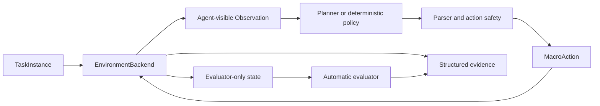

# ObsidianLink

ObsidianLink 是一个可复现的 Minecraft 单智能体与多智能体 Benchmark，用于评测 Agent 在进入下界任务中的路线选择、环境感知、长程规划、具身执行、错误恢复和协作能力。所有结果都需要自动 evaluator 与可审核运行证据支持。

## Benchmark Vision

最终 Benchmark 包含三个 Task Families：

- **Casting**：通过水、熔岩和原版方块更新机制浇筑门框，点火并进入 Nether；
- **Ruined Portal**：探索废弃传送门、判断缺口、利用资源修复，点火并进入 Nether；
- **Adaptive Routing**：比较两种路线的可行性和成本，在失败或条件变化时重规划或切换。

Single-Agent 与 Multi-Agent 是和任务族正交的 Agent Modes：

| Task Family | Single-Agent | Multi-Agent |
|---|---|---|
| Casting | Casting-S | Casting-M |
| Ruined Portal | Ruined-S | Ruined-M |
| Adaptive Routing | Adaptive-S | Adaptive-M |

端到端成功要求至少一名任务指定 Agent，通过当前 episode 中完成建造、修复或激活的传送门实际进入 Nether。只找到结构、只完成门框、只点火、模型声称成功或 driver 正常退出都不够。

完整评分和信息边界见 [BENCHMARK_SPEC.md](BENCHMARK_SPEC.md)，任务层级与命名见 [TASK_TAXONOMY.md](docs/benchmark/TASK_TAXONOMY.md)。

## Current Implementation

当前阶段：`R6-C1-LIVE-MINERL-SMOKE-RUNNER-WIRING` 完成（offline）。已提供 offline-only C1 smoke runner（`execution_mode=offline_stub`），只接受受控 `OfflineC1StubEnvFactory`，拒绝任意 factory/外部 backend/live 请求；完整 TaskInstance、预算、精确库存与 plan 在环境创建前冻结校验。Evidence 使用同父目录 staging + 原子 rename，拒绝覆盖已有输出。CLI：`scripts/run_c1_live_smoke.py --mode offline_stub --output-dir <尚不存在的绝对路径>`。`R6-C5-LIVE-MINERL-BACKEND-WIRING` 已完成 typed truth 离线接通。C5 仍保持 `implementation_status="contract_only"`、`live_run_allowed=false`；真实 MineRL/Minecraft 中的水、熔岩、黑曜石变化、task-origin/grid 锚定和 `portal_transition` bridge 尚未验证。

当前 active implementation 仍是 Casting-S-C2 / fixed 的 `casting_c3_fixed`。R6-C3/C4/C5 evaluator + deterministic driver 已在 FakeBackend 上完成离线证明；MineRL backend 已接通 typed casting evaluator truth（offline-only），不冒充 live implementation。C1 live smoke 身份冻结为 Casting-S-C1 / fixed（兼容 ID `casting_c1_fixed`，指定 `agent_1`）；操作合同见 [C1 Live MineRL Smoke](docs/runbooks/C1_LIVE_MINERL_SMOKE.md)。

[`benchmark/catalog/tasks.json`](benchmark/catalog/tasks.json) 是任务身份、taxonomy、兼容路径和发布可见性的统一索引。早期 `route_a_a0` 实例被明确标为 calibration/regression，不计入正式 Benchmark task matrix；详细兼容规则见 [TASK_REGISTRY.md](docs/architecture/TASK_REGISTRY.md)。

R6 合同冻结阶段已新增 3 个 Casting-S benchmark 任务实例，分类为 Casting-S-C3 / C4 / C5（`fixed`）。它们继续使用水、熔岩与原版 block update，并把公开门框/点火/进入目标与 evaluator attribution 合同分开冻结：

- [Casting-S-C3 任务页](docs/tasks/casting/casting_s_c3_fixed.md) — 浇筑公开 4×5 full ring（原版最小合法 10 块，本固定实例要求含四角 14 块；不点火、不进入 Nether）；R6-C3-FRAME-EVALUATOR 与 R6-C3-DETERMINISTIC-DRIVER 子阶段在 FakeBackend 上完成了 `FrozenFrameEvaluator`、task-origin / truth-grid 坐标锚定、严格 public context、capability gate、336-step deterministic driver 和独立 truth 编排的离线证明；
- [Casting-S-C4 任务页](docs/tasks/casting/casting_s_c4_fixed.md) — 有效门框 + 合法 `use_item(flint_and_steel)` 点火；R6-C4-IGNITION-EVALUATOR 与 R6-C4-DETERMINISTIC-DRIVER 子阶段在 FakeBackend 上完成了 `FrozenIgnitionEvaluator`、typed `FrozenFrameIdentity`、精确目标/动作归因/4-step 因果窗口/latched frame identity 绑定/agent-id 一致性、独立 truth 注入路径、AST 锁定的 evaluator-only 隔离、严格 public context、capability gate、340-step deterministic driver（含 4 step ignition 子计划）和独立 truth 编排的离线证明；
- [Casting-S-C5 任务页](docs/tasks/casting/casting_s_c5_fixed.md) — 有效门框 + 合法点火 + 指定 Agent 通过本 episode 门框进入 Nether；`FrozenNetherEntryEvaluator`、typed `NetherEntryEvidence`、transition/portal/frame-identity 归因、独立 FakeBackend truth 槽和 347-step C5 deterministic driver 已在 FakeBackend 上完成离线实现。

3 个新任务在 catalog 中仍标为 `implementation_status="contract_only"`、`live_run_allowed=false`；`active_compatibility_id` 保持 `casting_c3_fixed`（C2），因此 C3/C4/C5 还没有接入正式 experiment runner 或 live implementation。R6-C3 已完成 frame evaluator/driver，R6-C4 已完成 ignition evaluator/driver；R6-C5 已完成 Nether-entry evaluator/driver 与 FakeBackend 独立 truth 路径。真实 MineRL 接入、Gradle 和模型 API 仍未实现。

当前已验证范围：

- FakeBackend 离线能力清单与 fail-closed capability gate；
- 单块黑曜石独立 evaluator；
- 确定性、有限动作/等待/恢复的单块 driver；
- 三 cell continuous evaluator、72 步 deterministic driver 和 per-cell 因果证据；
- 有序前缀 `partial_completion`、有限恢复、预算失败与确定性重放；
- Agent-visible observation 与 evaluator-only truth 隔离；
- 结构化身份字段、证据快照和离线测试；
- C3/C4/C5 水/熔岩浇筑任务合同、公开 frame plan、evaluator attribution 合同与 catalog 一致性；
- C3 frozen-frame evaluator、14-cell full-ring success / corner requirement / wrong-block / interior-blocker / causality / 预算 / 异常终止判定、闭集 outcome 优先级、`as_dict()` 快照和确定性重放；
- 任务原点与 truth-grid 原点坐标锚定（`FrozenFrameOriginAnchor`，默认 `default_c3_anchor()` 把 task-origin 标记对齐到 grid 原点 `(0, 0, 0)`）；
- FakeBackend 独立 C3 frame evaluation state 槽位 + 严格 workflow / 身份校验（`casting_s_c3_fixed` / `episode_id` / `step_id` / `agent_id`） + `reset` / `step` / `close` 自动清空 + Observation 不泄漏；
- AST 锁定的 evaluator 信息隔离：源文件不 import `agents` / `workflows` / `drivers` 也不读取 `scenario_parameters` / `evaluator_contract` / `instruction`。
- C3 14-cell、336-step deterministic driver，严格 public context、动作白名单、有限预算/恢复、clean-import 边界和缺失 backend capability 时 reset 前 fail closed；
- 测试 orchestrator 独立注入 evaluator-only truth，driver 不读取 frame truth，最终 verdict 只由 `FrozenFrameEvaluator` 给出。
- C4 ignition evaluator：typed `FrozenFrameIdentity` 强制 orientation / min_corner / max_corner / width / height / target_offsets / interior_offsets / required_corner_count / required_full_ring_count / activation_offsets / episode_id / step_id / agent_id 全部冻结可序列化；target/interior offsets 必须与 C3 合同精确同序且无重复，activation offsets 必须是非空、无重复、canonical-order 的内部子集并包含实际观测激活点。`build_c4_c3_frame_identity` 构造规范身份，任意 mapping、重排/重复 offsets 或矛盾 activation snapshot 都不能冒充成功。`IgnitionActionEvidence` 构造期只做结构/类型检查（语义白名单由 evaluator 判定），`PortalActivationEvidence.agent_id` 必填且必须与 ignition action agent 一致；wrong agent / action / item / target / external activation / activation 早于 ignition / 超出 4 步窗口 / identity missing / identity mismatch / identity geometry mismatch 都通过公开构造 API 可达并由 evaluator 产出稳定 fail-closed outcome。
- FakeBackend 独立 C4 ignition evaluation state 槽位 + 严格 workflow / 身份校验（`casting_s_c4_fixed` / `episode_id` / `step_id` / `agent_id`） + `reset` / `step` / `close` 自动清空 + Observation 不泄漏 + 与 C1/C2/C3 槽位互不污染。
- C4 deterministic driver：14-cell × 24 + 4 = 340 步（336 C3 浇筑 + 4 C4 点火子计划）；公开 `use_item(flint_and_steel)` 在唯一计分目标 `[1, 1, 1]`；4-step 因果窗口（delta ∈ [0, 4] inclusive）；strictly-typed `FrozenFrameIdentity` 绑定；capability gate 在 reset 前 fail closed；有限恢复只响应 typed `RecoverableBackendError`；driver status 闭集 `completed` / `blocked` / `failed`，永不返回 `success` / `passed`；AST + 源码双门锁确认 driver 不 import / 调用任何 C4 ignition evaluator 表面、也不读取 `scenario_parameters` / `evaluator_contract` / `FrozenFrameIdentity` / `IgnitionActionEvidence` / `PortalActivationEvidence` / `FrozenIgnitionEvaluationState`；测试 orchestrator 独立通过 `set_ignition_evaluation_state` 注入 truth，最终 verdict 只由 `FrozenIgnitionEvaluator` 给出。
- C5 Nether-entry evaluator：复用 `FrozenIgnitionEvaluator` 重新验证 C4 success；指定 `agent_1` 必须从 `minecraft:overworld` 切换到 `minecraft:the_nether`，transition 不得早于 portal activation，并要求切换前位置、明确的 `entered_via_episode_portal=True` 与同一个 typed `FrozenFrameIdentity`；未知归因和外部进入分别稳定产出 `nether_entry_portal_unknown` / `nether_entry_not_via_episode_portal`；FakeBackend C5 truth 槽与 C1–C4 隔离且不进入 Observation。

当前未验证或未实现：

- 真实 MineRL/Minecraft 浇筑、门框建造与点火；
- 真实 MineRL 中 task-origin marker 与 evaluator truth-grid origin 的世界坐标锚定；现有 grid 数值范围已经覆盖固定方案，但不等于 live 锚定已验证；
- Ruined Portal、Adaptive Routing 和 Multi-Agent；
- 正式 benchmark episode 数据集。

C2 实例位于 [`casting_c3_fixed.json`](benchmark/instances/active/casting_c3_fixed.json)，C2 离线合同位于 [`casting_c3_contract.json`](configs/experiments/active/casting_c3_contract.json)，详细规则见 [`casting_c3_fixed` 任务页](docs/tasks/casting/casting_c3_fixed.md)。基础回归与 C1 live smoke 合同见 [`casting_c1_fixed` 任务页](docs/tasks/casting/casting_c1_fixed.md) 与 [C1 Live MineRL Smoke](docs/runbooks/C1_LIVE_MINERL_SMOKE.md)。R6 合同冻结的 C3 / C4 / C5 实例位于 [`benchmark/instances/casting/single/`](benchmark/instances/casting/single/)。`R6-C1-LIVE-MINERL-SMOKE-RUNNER-WIRING` 已完成 offline；下一步必须是用户单独授权的一次 C1 真实 MineRL smoke run，而不是直接进入 C5 或 R7。

## 系统架构



### TaskInstance

未来新任务的合同必须冻结 family、mode、level、layout、seed、Agent、出生点、初始资源、里程碑和预算。解析后数据不可变，运行过程中不能修改任务合同。现有 schema 和历史实例暂不因 B0 文档设计而改变。

### EnvironmentBackend

环境后端统一提供 `open`、`reset`、`step`、`get_evaluation_state` 和 `close` 生命周期：

- `FakeEnvironmentBackend` 用于不启动 Minecraft 的离线验证；
- MineRL backend 负责未来真实环境生命周期、动作执行和 evaluator 状态采集；
- Planner 只使用公开 observation，不读取 evaluator truth。

### 动作安全层

Planner 输出不能直接控制游戏。所有动作先经过结构解析、封闭白名单、类型检查和数值限制，再转换为有限的 `MacroAction`。系统不执行模型生成的代码、shell 命令或 Minecraft 命令。

### Planner 边界

环境 step loop 和模型推理解耦；环境 owner 不等待 Planner I/O，过期决策必须丢弃。所有 step、等待、重试、恢复、消息和模型调用均有硬上限。

### Evaluator

Evaluator 使用独立环境真值判断任务结果。目标方块、流体状态、隐藏 Portal 结构、Adaptive 可行路线/参考成本和评分结果不能进入 prompt、memory 或 Agent 间消息。Multi-Agent 中各 Agent 的私有 observation/memory 也必须隔离。

## 成功与指标

Success Rate 是主要指标；Completion Rate、Environment Steps、Game Time、Model Calls、Invalid Action Rate、Recovery Rate 和 Evidence Completeness 是辅助指标。Adaptive 与 Multi-Agent 另有路线选择、切换、通信、makespan、重复工作和贡献指标。项目不使用未经验证的单一综合分数。

`casting_c1_fixed` 的 `success` 只证明 C1 单块切片，`casting_c3_fixed` 的 `success` 只证明 C2 连续浇筑切片；两者都不代表完整传送门或进入 Nether。Driver 结束、模型返回 `accepted=true` 或画面看似正确均不能单独证明成功。

## 项目结构

```text
ObsidianLink/
├── PROJECT_STATUS.md       当前唯一任务和交付标准
├── AGENTS.md               Agent 开发规则
├── ROADMAP.md              分阶段工程与 Benchmark 发布路线
├── BENCHMARK_SPEC.md       权威总规范、指标和信息边界
├── DATASET_CARD.md         运行证据与未来统一元数据
├── benchmark/              任务实例和 schema
│   └── catalog/            canonical taxonomy 与历史兼容路径索引
├── configs/                实验合同
├── obsidianlink/           协议、backend、driver、evaluator 与 workflow
├── docs/
│   ├── benchmark/          taxonomy 与 Benchmark 设计
│   ├── tasks/              具体任务合同说明
│   └── runbooks/           操作说明
├── scripts/                检查、运行、探针和回放入口
├── tests/                  离线单元与集成测试
├── runs/                   正式运行证据（当前无真实数据）
└── vendor/minerl/          独立的 MineRL 嵌套仓库
```

`vendor/minerl` 有独立 Git 历史。外层项目不得提交、删除或改写它；任何修改和 Gradle 构建都需要用户单独授权。

## 运行证据

正式 episode 的证据写入 `runs/<task>/<timestamp>/`，至少包括：

```text
task_instance.json
experiment_config.json
capability_manifest.json
code_version.json
initial.png
final.png
events.jsonl
evaluator_events.jsonl
summary.json
manual_review.md
```

Observation、action、message、evaluation 和 log 均带 `episode_id`、`step_id`，适用时带 `agent_id`。Agent-visible 与 evaluator-only 数据分开保存；运行目录不得保存 API key、模型权重或隐藏推理。

## 固定开发环境

项目固定使用：

- Python 3.10.20
- OpenJDK 8
- Gym 0.23.1
- NumPy 1.23.5
- PyTorch 2.13.0
- Transformers 4.57.6

完整依赖位于 [`environment.yml`](environment.yml)，模型修订位于 [`model.lock.json`](model.lock.json)。不得自行升级版本，也不要为了文档或普通离线检查重装环境。

## 离线检查

开始工作前：

```bash
git status --short
python -m obsidianlink --check
```

修改后：

```bash
python -m obsidianlink --check
python scripts/check_environment.py
python -m unittest discover -s tests -p 'test_*.py'
git diff --check
```

这些检查不应启动 Minecraft。真实 MineRL、Minecraft、Gradle、付费模型 API、Git commit 和 push 都需要明确授权。

## Agent 工作流程

1. 阅读 [PROJECT_STATUS.md](PROJECT_STATUS.md) 和当前任务边界。
2. 查看工作区修改，保留不属于本任务的用户内容。
3. 区分长期 Benchmark scope 与当前 active implementation。
4. 只实现当前阶段的最小交付，先用 FakeBackend 和确定性流程。
5. 运行相关离线测试并检查信息隔离。
6. 更新 `PROJECT_STATUS.md`，写明结果、限制和下一任务。
7. 未经授权不启动真实环境、不提交、不推送。

## 核心文档

- [PROJECT_STATUS.md](PROJECT_STATUS.md)：当前唯一任务与交付状态
- [AGENTS.md](AGENTS.md)：必须遵守的开发规则
- [BENCHMARK_SPEC.md](BENCHMARK_SPEC.md)：Benchmark 权威总规范
- [TASK_TAXONOMY.md](docs/benchmark/TASK_TAXONOMY.md)：任务分类与命名
- [TASK_REGISTRY.md](docs/architecture/TASK_REGISTRY.md)：Catalog、兼容路径与 calibration 分类
- [ROADMAP.md](ROADMAP.md)：工程阶段与 Benchmark 发布路线
- [DATASET_CARD.md](DATASET_CARD.md)：数据、证据和隐私边界
- [`casting_c1_fixed` 任务页](docs/tasks/casting/casting_c1_fixed.md)：当前最小切片合同
- [`casting_c3_fixed` 任务页](docs/tasks/casting/casting_c3_fixed.md)：当前连续浇筑合同与 C2 兼容映射
