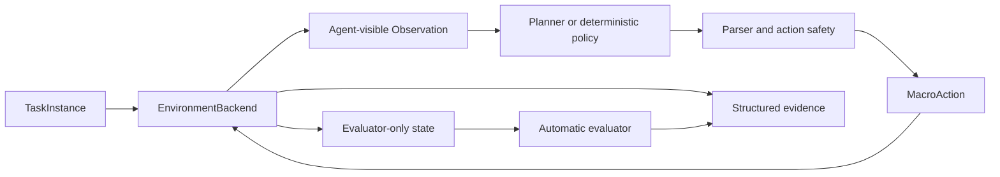

# ObsidianLink

ObsidianLink 是一个可复现的 Minecraft 单智能体与多智能体 Benchmark，用于评测 Agent 在进入下界任务中的路线选择、环境感知、长程规划、具身执行、错误恢复和协作能力。所有结果都需要自动 evaluator 与可审核运行证据支持。

## Benchmark Vision

最终 Benchmark 包含三个 Task Families：

- **Casting**：通过水、熔岩和原版方块更新机制浇筑门框，点火并进入 Nether；
- **Ruined Portal**：探索废弃传送门、判断缺口、利用资源修复，点火并进入 Nether；
- **Adaptive Routing**：比较两种路线的可行性和成本，在失败或条件变化时重规划或切换。

Single-Agent 与 Multi-Agent 是和任务族正交的 Agent Modes：

| Task Family | Single-Agent | Multi-Agent |
|---|---|---|
| Casting | Casting-S | Casting-M |
| Ruined Portal | Ruined-S | Ruined-M |
| Adaptive Routing | Adaptive-S | Adaptive-M |

端到端成功要求至少一名任务指定 Agent，通过当前 episode 中完成建造、修复或激活的传送门实际进入 Nether。只找到结构、只完成门框、只点火、模型声称成功或 driver 正常退出都不够。

完整评分和信息边界见 [BENCHMARK_SPEC.md](BENCHMARK_SPEC.md)，任务层级与命名见 [TASK_TAXONOMY.md](docs/benchmark/TASK_TAXONOMY.md)。

## Current Implementation

当前阶段：`B0-BENCHMARK-SCOPE-FREEZE`（文档范围冻结）

当前 active implementation 仍是 `casting_c1_fixed`，分类为 Casting-S-C1、fixed layout，兼容名称为 `casting_s_c1_fixed`。它只要求在固定受控场景中用原版水和熔岩生成一块黑曜石，是整个 Benchmark 最底层的单项能力测试。

当前已验证范围：

- FakeBackend 离线能力清单与 fail-closed capability gate；
- 单块黑曜石独立 evaluator；
- 确定性、有限动作/等待/恢复的单块 driver；
- Agent-visible observation 与 evaluator-only truth 隔离；
- 结构化身份字段、证据快照和离线测试。

当前未验证或未实现：

- 真实 MineRL/Minecraft 浇筑；
- 完整门框、点火和进入 Nether；
- Ruined Portal、Adaptive Routing 和 Multi-Agent；
- 正式 benchmark episode 数据集。

任务实例位于 [`casting_c1_fixed.json`](benchmark/instances/active/casting_c1_fixed.json)，离线合同位于 [`casting_c1_contract.json`](configs/experiments/active/casting_c1_contract.json)，详细规则见 [`casting_c1_fixed` 任务页](docs/tasks/casting/casting_c1_fixed.md)。B0 后的下一工程任务仍是 `R5-CONTINUOUS-CASTING`；本轮不实现它。

## 系统架构



### TaskInstance

未来新任务的合同必须冻结 family、mode、level、layout、seed、Agent、出生点、初始资源、里程碑和预算。解析后数据不可变，运行过程中不能修改任务合同。现有 schema 和历史实例暂不因 B0 文档设计而改变。

### EnvironmentBackend

环境后端统一提供 `open`、`reset`、`step`、`get_evaluation_state` 和 `close` 生命周期：

- `FakeEnvironmentBackend` 用于不启动 Minecraft 的离线验证；
- MineRL backend 负责未来真实环境生命周期、动作执行和 evaluator 状态采集；
- Planner 只使用公开 observation，不读取 evaluator truth。

### 动作安全层

Planner 输出不能直接控制游戏。所有动作先经过结构解析、封闭白名单、类型检查和数值限制，再转换为有限的 `MacroAction`。系统不执行模型生成的代码、shell 命令或 Minecraft 命令。

### Planner 边界

环境 step loop 和模型推理解耦；环境 owner 不等待 Planner I/O，过期决策必须丢弃。所有 step、等待、重试、恢复、消息和模型调用均有硬上限。

### Evaluator

Evaluator 使用独立环境真值判断任务结果。目标方块、流体状态、隐藏 Portal 结构、Adaptive 可行路线/参考成本和评分结果不能进入 prompt、memory 或 Agent 间消息。Multi-Agent 中各 Agent 的私有 observation/memory 也必须隔离。

## 成功与指标

Success Rate 是主要指标；Completion Rate、Environment Steps、Game Time、Model Calls、Invalid Action Rate、Recovery Rate 和 Evidence Completeness 是辅助指标。Adaptive 与 Multi-Agent 另有路线选择、切换、通信、makespan、重复工作和贡献指标。项目不使用未经验证的单一综合分数。

`casting_c1_fixed` 的 evaluator outcome `success` 只证明单块 C1 切片完成，不代表完整传送门或进入 Nether。Driver 结束、模型返回 `accepted=true` 或画面看似正确均不能单独证明成功。

## 项目结构

```text
ObsidianLink/
├── PROJECT_STATUS.md       当前唯一任务和交付标准
├── AGENTS.md               Agent 开发规则
├── ROADMAP.md              分阶段工程与 Benchmark 发布路线
├── BENCHMARK_SPEC.md       权威总规范、指标和信息边界
├── DATASET_CARD.md         运行证据与未来统一元数据
├── benchmark/              任务实例和 schema
├── configs/                实验合同
├── obsidianlink/           协议、backend、driver、evaluator 与 workflow
├── docs/
│   ├── benchmark/          taxonomy 与 Benchmark 设计
│   ├── tasks/              具体任务合同说明
│   └── runbooks/           操作说明
├── scripts/                检查、运行、探针和回放入口
├── tests/                  离线单元与集成测试
├── runs/                   正式运行证据（当前无真实数据）
└── vendor/minerl/          独立的 MineRL 嵌套仓库
```

`vendor/minerl` 有独立 Git 历史。外层项目不得提交、删除或改写它；任何修改和 Gradle 构建都需要用户单独授权。

## 运行证据

正式 episode 的证据写入 `runs/<task>/<timestamp>/`，至少包括：

```text
task_instance.json
experiment_config.json
capability_manifest.json
code_version.json
initial.png
final.png
events.jsonl
evaluator_events.jsonl
summary.json
manual_review.md
```

Observation、action、message、evaluation 和 log 均带 `episode_id`、`step_id`，适用时带 `agent_id`。Agent-visible 与 evaluator-only 数据分开保存；运行目录不得保存 API key、模型权重或隐藏推理。

## 固定开发环境

项目固定使用：

- Python 3.10.20
- OpenJDK 8
- Gym 0.23.1
- NumPy 1.23.5
- PyTorch 2.13.0
- Transformers 4.57.6

完整依赖位于 [`environment.yml`](environment.yml)，模型修订位于 [`model.lock.json`](model.lock.json)。不得自行升级版本，也不要为了文档或普通离线检查重装环境。

## 离线检查

开始工作前：

```bash
git status --short
python -m obsidianlink --check
```

修改后：

```bash
python -m obsidianlink --check
python scripts/check_environment.py
python -m unittest discover -s tests -p 'test_*.py'
git diff --check
```

这些检查不应启动 Minecraft。真实 MineRL、Minecraft、Gradle、付费模型 API、Git commit 和 push 都需要明确授权。

## Agent 工作流程

1. 阅读 [PROJECT_STATUS.md](PROJECT_STATUS.md) 和当前任务边界。
2. 查看工作区修改，保留不属于本任务的用户内容。
3. 区分长期 Benchmark scope 与当前 active implementation。
4. 只实现当前阶段的最小交付，先用 FakeBackend 和确定性流程。
5. 运行相关离线测试并检查信息隔离。
6. 更新 `PROJECT_STATUS.md`，写明结果、限制和下一任务。
7. 未经授权不启动真实环境、不提交、不推送。

## 核心文档

- [PROJECT_STATUS.md](PROJECT_STATUS.md)：当前唯一任务与交付状态
- [AGENTS.md](AGENTS.md)：必须遵守的开发规则
- [BENCHMARK_SPEC.md](BENCHMARK_SPEC.md)：Benchmark 权威总规范
- [TASK_TAXONOMY.md](docs/benchmark/TASK_TAXONOMY.md)：任务分类与命名
- [ROADMAP.md](ROADMAP.md)：工程阶段与 Benchmark 发布路线
- [DATASET_CARD.md](DATASET_CARD.md)：数据、证据和隐私边界
- [`casting_c1_fixed` 任务页](docs/tasks/casting/casting_c1_fixed.md)：当前最小切片合同
